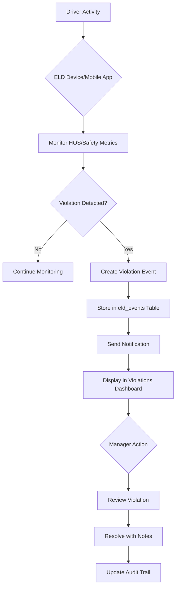

# ELD Violation Detection and Resolution Workflow

Documentation of violation detection, tracking, and resolution workflow in TruckMates ELD system.

## Overview

The TruckMates ELD system automatically detects Hours of Service (HOS) violations and other safety events, tracks them through a resolution workflow, and maintains a complete audit trail for compliance purposes.

## Violation Types

### HOS Violations

#### 1. Drive Time Violation

**Type:** `hos_violation`  
**Severity:** `critical`  
**Description:** Driver exceeded 11-hour driving limit

**Detection:**
- Triggered when remaining drive time reaches 0 while driver is in "driving" status
- Calculated using rolling 11-hour window
- Detected in real-time by mobile app or ELD device

**Example:**
```json
{
  "event_type": "hos_violation",
  "severity": "critical",
  "title": "Drive Time Violation",
  "description": "Exceeded maximum 11-hour drive time limit",
  "event_time": "2024-01-15T19:30:00Z"
}
```

#### 2. On-Duty Time Violation

**Type:** `hos_violation`  
**Severity:** `critical`  
**Description:** Driver exceeded 14-hour on-duty limit

**Detection:**
- Triggered when remaining on-duty time reaches 0
- Calculated using rolling 14-hour window
- Includes both driving and on-duty (not driving) time

**Example:**
```json
{
  "event_type": "hos_violation",
  "severity": "critical",
  "title": "On-Duty Time Violation",
  "description": "Exceeded maximum 14-hour on-duty time limit",
  "event_time": "2024-01-15T20:00:00Z"
}
```

#### 3. Break Required

**Type:** `hos_violation`  
**Severity:** `warning`  
**Description:** Driver needs 30-minute break after 8 hours driving

**Detection:**
- Triggered when driver has 8+ hours driving with less than 30 minutes off-duty
- Warning severity (not critical) - driver can still drive but should take break soon

**Example:**
```json
{
  "event_type": "hos_violation",
  "severity": "warning",
  "title": "Break Required",
  "description": "30-minute break required after 8 hours on duty",
  "event_time": "2024-01-15T16:00:00Z"
}
```

### Safety Violations

#### 4. Speeding

**Type:** `speeding`  
**Severity:** `warning`  
**Description:** Vehicle speed exceeds speed limit

**Detection:**
- Triggered when GPS speed > speed limit (default: 65 MPH)
- Configurable threshold per company
- Detected by mobile app or ELD device GPS

**Example:**
```json
{
  "event_type": "speeding",
  "severity": "warning",
  "title": "Speeding Violation",
  "description": "Driving at 75 MPH (limit: 65 MPH)",
  "event_time": "2024-01-15T14:30:00Z",
  "metadata": {
    "speed": 75,
    "speed_limit": 65
  }
}
```

#### 5. Hard Braking

**Type:** `hard_brake`  
**Severity:** `warning`  
**Description:** Sudden deceleration detected

**Detection:**
- Triggered when deceleration exceeds threshold (default: -0.3g)
- Calculated from speed change over time
- Indicates aggressive driving behavior

**Example:**
```json
{
  "event_type": "hard_brake",
  "severity": "warning",
  "title": "Hard Braking Event",
  "description": "Hard brake detected (-0.45g)",
  "event_time": "2024-01-15T15:00:00Z",
  "metadata": {
    "g_force": -0.45,
    "speed_change": -15
  }
}
```

#### 6. Hard Acceleration

**Type:** `hard_accel`  
**Severity:** `info`  
**Description:** Sudden acceleration detected

**Detection:**
- Triggered when acceleration exceeds threshold (default: +0.3g)
- Calculated from speed change over time
- Lower severity than hard braking (info vs warning)

**Example:**
```json
{
  "event_type": "hard_accel",
  "severity": "info",
  "title": "Hard Acceleration Event",
  "description": "Hard acceleration detected (+0.35g)",
  "event_time": "2024-01-15T15:15:00Z",
  "metadata": {
    "g_force": 0.35,
    "speed_change": 12
  }
}
```

#### 7. Device Malfunction

**Type:** `device_malfunction`  
**Severity:** `critical`  
**Description:** ELD device malfunction detected

**Detection:**
- Triggered by device self-diagnostics
- Indicates hardware or connectivity issues
- Requires immediate attention

**Example:**
```json
{
  "event_type": "device_malfunction",
  "severity": "critical",
  "title": "Device Malfunction",
  "description": "GPS signal lost for 5+ minutes",
  "event_time": "2024-01-15T16:00:00Z"
}
```

## Violation Severity Levels

| Severity | Description | Action Required |
|----------|-------------|-----------------|
| **Critical** | Immediate safety or compliance risk | Driver must stop, manager notified immediately |
| **Warning** | Potential violation or safety concern | Driver should address soon, manager notified |
| **Info** | Informational event | Logged for records, no immediate action |

## Violation Detection Flow



## Resolution Workflow

### 1. Violation Detection

Violations are automatically detected and stored:

```typescript
// Automatic detection in mobile app
const violations = detectHOSViolations(
  currentStatus,
  currentStatusStartTime,
  recentLogs
)

// Send to server
await fetch('/api/eld/mobile/events', {
  method: 'POST',
  body: JSON.stringify({
    device_id: deviceId,
    events: violations
  })
})
```

### 2. Violation Display

Violations appear in the violations dashboard:

- **Unresolved violations** shown at top
- **Filtered by**: Driver, severity, date range, status
- **Sorted by**: Event time (newest first)

### 3. Violation Review

Manager reviews violation details:

- Event type and severity
- Driver information
- Location and timestamp
- Description and metadata
- Related HOS logs

### 4. Violation Resolution

Manager resolves violation:

1. Click "Resolve" button
2. Add resolution notes (optional)
3. Submit resolution
4. System updates:
   - `resolved: true`
   - `resolved_at: timestamp`
   - `resolved_by: user_id`
   - Notes stored in database

### 5. Audit Trail

Complete audit trail maintained:

- Original violation event
- Resolution timestamp
- Who resolved it
- Resolution notes
- All changes logged

## Database Schema

### eld_events Table

```sql
CREATE TABLE eld_events (
  id UUID PRIMARY KEY,
  company_id UUID,
  eld_device_id UUID,
  driver_id UUID,
  truck_id UUID,
  event_type TEXT, -- 'hos_violation', 'speeding', 'hard_brake', etc.
  severity TEXT, -- 'info', 'warning', 'critical'
  title TEXT,
  description TEXT,
  event_time TIMESTAMP,
  location JSONB, -- { lat, lng, address }
  resolved BOOLEAN DEFAULT false,
  resolved_at TIMESTAMP,
  resolved_by UUID, -- User who resolved
  metadata JSONB, -- Additional event data
  created_at TIMESTAMP
);
```

## API Reference

### Get Violations

**Endpoint:** Server Action `getELDEvents(filters?)`

**Filters:**
```typescript
{
  driver_id?: string,
  event_type?: string,
  severity?: string,
  resolved?: boolean,
  start_date?: string,
  end_date?: string
}
```

**Returns:**
```typescript
{
  data: ELDEvent[],
  error: string | null
}
```

### Resolve Violation

**Endpoint:** Server Action `resolveELDEvent(eventId)`

**Parameters:**
- `eventId` (string, required): Event UUID

**Returns:**
```typescript
{
  data: {
    id: string,
    resolved: true,
    resolved_at: string,
    resolved_by: string
  },
  error: string | null
}
```

## Violation Resolution UI

The violations page (`/dashboard/eld/violations`) provides:

### Filters

- **Driver**: Filter by specific driver
- **Status**: Open, Resolved, All
- **Severity**: Critical, Warning, Info, All
- **Date Range**: Start and end date

### Actions

- **View Details**: See full violation information
- **Resolve**: Mark violation as resolved with notes
- **Export**: Export violations to CSV/Excel

### Violation Card

Each violation displays:

- Event type and severity badge
- Driver name and truck number
- Event time and location
- Description
- Resolution status
- Action buttons

## Audit Trail

Complete audit trail includes:

1. **Original Event**:
   - When detected
   - By which device
   - Event details

2. **Resolution**:
   - When resolved
   - Who resolved it
   - Resolution notes

3. **History**:
   - All status changes
   - Notes added
   - Timestamps

### Example Audit Trail

```json
{
  "id": "event-uuid",
  "event_type": "hos_violation",
  "severity": "critical",
  "title": "Drive Time Violation",
  "event_time": "2024-01-15T19:30:00Z",
  "resolved": true,
  "resolved_at": "2024-01-15T20:15:00Z",
  "resolved_by": "manager-uuid",
  "metadata": {
    "resolution_notes": "Driver took required 10-hour break. Violation resolved after compliance restored.",
    "resolved_by_name": "John Manager"
  }
}
```

## Compliance Reporting

Violations are included in compliance reports:

- **DOT Reports**: All violations included
- **Driver Scorecards**: Violations affect driver scores
- **Fleet Analytics**: Violation trends and patterns
- **Export**: CSV/Excel export for external reporting

## Best Practices

1. **Immediate Review**: Review critical violations immediately
2. **Documentation**: Always add resolution notes explaining the resolution
3. **Driver Communication**: Notify drivers of violations and required actions
4. **Training**: Use violations as training opportunities
5. **Trend Analysis**: Monitor violation patterns to identify systemic issues

## Integration

Violations integrate with:

- **Notifications**: Email/SMS alerts for critical violations
- **Driver Scorecards**: Violations affect driver performance scores
- **Compliance Reports**: Included in DOT and IFTA reports
- **Analytics**: Violation trends and statistics

## Future Enhancements

Planned improvements:

1. **Automatic Resolution**: Auto-resolve violations when conditions are met
2. **Violation Categories**: Group violations by type for better organization
3. **Violation Templates**: Pre-defined resolution notes for common violations
4. **Escalation Rules**: Automatic escalation for unresolved critical violations
5. **Violation Analytics**: Advanced analytics and predictive violation detection


