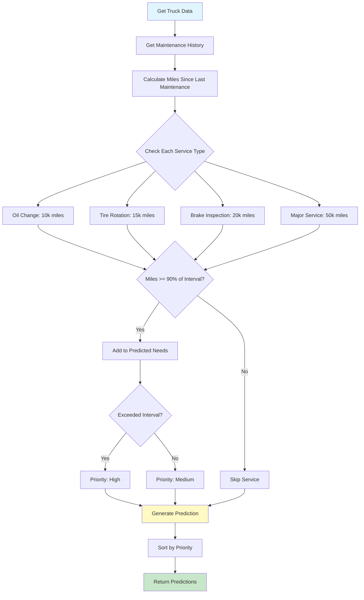

# Predictive Maintenance Algorithm Documentation

Comprehensive documentation of the predictive maintenance algorithm, data sources, and methodology.

## Overview

TruckMates uses a rule-based predictive maintenance algorithm that analyzes truck mileage, maintenance history, and standard maintenance intervals to predict when maintenance services are needed.

## Algorithm Methodology

### Data Sources

The algorithm uses the following data:

1. **Truck Information**
   - Current mileage (`current_mileage`)
   - Last maintenance mileage (`last_maintenance_mileage`)
   - Last maintenance date (`last_maintenance_date`)

2. **Maintenance History**
   - Service type
   - Service date
   - Mileage at service
   - Service cost

3. **Standard Intervals**
   - Oil change: 10,000 miles
   - Tire rotation: 15,000 miles
   - Brake inspection: 20,000 miles
   - Major service: 50,000 miles

### Calculation Process



### Miles Since Last Maintenance

**Formula:**
```
Miles Since Last Maintenance = Current Mileage - Last Maintenance Mileage
```

**If No Maintenance History:**
```
Miles Since Last Maintenance = Current Mileage
```

### Prediction Logic

For each service type, the algorithm checks:

1. **Threshold Check**: `Miles Since Last Maintenance >= (Interval × 0.9)`
   - 90% threshold triggers prediction
   - Allows proactive scheduling before due date

2. **Priority Assignment**:
   - **High Priority**: Miles >= 100% of interval (overdue)
   - **Medium Priority**: Miles >= 90% but < 100% of interval (due soon)
   - **Low Priority**: Miles < 90% of interval (not needed)

3. **Estimated Mileage**:
   ```
   Estimated Mileage = Last Maintenance Mileage + Service Interval
   ```

## Maintenance Intervals

### Standard Intervals

| Service Type | Interval | Threshold (90%) | Description |
|--------------|----------|-----------------|-------------|
| **Oil Change** | 10,000 miles | 9,000 miles | Regular engine oil and filter change |
| **Tire Rotation** | 15,000 miles | 13,500 miles | Rotate tires for even wear |
| **Brake Inspection** | 20,000 miles | 18,000 miles | Inspect brake pads, rotors, and fluid |
| **Major Service** | 50,000 miles | 45,000 miles | Comprehensive vehicle service |

### Customizable Intervals

**Future Enhancement:**
- Allow companies to set custom intervals per truck type
- Support different intervals for different makes/models
- Adjust intervals based on usage patterns

## Prediction Output

### Prediction Structure

```typescript
{
  truck_id: string,
  truck_number: string,
  make: string,
  model: string,
  current_mileage: number,
  miles_since_last_maintenance: number,
  last_maintenance_date: string | null,
  predicted_needs: Array<{
    type: string,                    // Service type
    priority: "high" | "medium" | "low",
    reason: string,                  // Explanation
    estimated_mileage: number        // Mileage when service needed
  }>,
  priority: "high" | "medium" | "low"  // Overall priority
}
```

### Example Prediction

```json
{
  "truck_id": "uuid-123",
  "truck_number": "T-001",
  "make": "Freightliner",
  "model": "Cascadia",
  "current_mileage": 105000,
  "miles_since_last_maintenance": 11000,
  "last_maintenance_date": "2024-01-01",
  "predicted_needs": [
    {
      "type": "Oil Change",
      "priority": "high",
      "reason": "Miles since last maintenance: 11,000",
      "estimated_mileage": 100000
    },
    {
      "type": "Tire Rotation",
      "priority": "medium",
      "reason": "Miles since last maintenance: 11,000",
      "estimated_mileage": 105000
    }
  ],
  "priority": "high"
}
```

## Priority Levels

### High Priority

**Criteria:**
- Miles since last maintenance >= 100% of service interval
- Service is overdue
- Requires immediate attention

**Actions:**
- Displayed prominently in dashboard
- Email/SMS notifications (if configured)
- Flagged in maintenance reports

### Medium Priority

**Criteria:**
- Miles since last maintenance >= 90% but < 100% of service interval
- Service due soon (within next 10% of interval)
- Proactive scheduling recommended

**Actions:**
- Displayed in maintenance dashboard
- Included in maintenance reports
- Can be scheduled in advance

### Low Priority

**Criteria:**
- Miles since last maintenance < 90% of service interval
- Service not needed yet
- No immediate action required

**Actions:**
- Not displayed in urgent maintenance list
- Included in full maintenance reports
- Tracked for future planning

## Algorithm Accuracy

### Strengths

1. **Simple and Reliable**: Rule-based approach is predictable
2. **Fast Calculation**: No complex computations
3. **Easy to Understand**: Clear logic based on mileage
4. **Proactive**: 90% threshold allows advance planning

### Limitations

1. **No Usage Pattern Analysis**: Doesn't consider driving conditions
2. **No Component Wear Analysis**: Doesn't track individual component health
3. **Fixed Intervals**: Doesn't adapt to actual usage patterns
4. **No Failure Prediction**: Only predicts scheduled maintenance, not failures

### Future Enhancements

1. **Machine Learning**: Learn from historical maintenance patterns
2. **Usage-Based Intervals**: Adjust intervals based on driving conditions
3. **Component-Specific Tracking**: Track individual component health
4. **Failure Prediction**: Predict component failures before they occur
5. **Cost Optimization**: Optimize maintenance scheduling for cost

## API Reference

### Predict Maintenance Needs

**Endpoint:** Server Action `predictMaintenanceNeeds(truckId?)`

**Parameters:**
- `truckId` (string, optional): Specific truck ID, or null for all trucks

**Returns:**
```typescript
{
  data: Array<{
    truck_id: string,
    truck_number: string,
    make: string,
    model: string,
    current_mileage: number,
    miles_since_last_maintenance: number,
    last_maintenance_date: string | null,
    predicted_needs: Array<{
      type: string,
      priority: "high" | "medium" | "low",
      reason: string,
      estimated_mileage: number
    }>,
    priority: "high" | "medium" | "low"
  }>,
  error: string | null
}
```

**Example:**
```typescript
// Predict for all trucks
const result = await predictMaintenanceNeeds()

// Predict for specific truck
const truckResult = await predictMaintenanceNeeds(truckId)
```

### Create Maintenance from Prediction

**Endpoint:** Server Action `createMaintenanceFromPrediction(data)`

**Parameters:**
```typescript
{
  truck_id: string,
  service_type: string,
  estimated_cost?: number,
  notes?: string
}
```

**Returns:**
```typescript
{
  data: MaintenanceRecord,
  error: string | null
}
```

**Example:**
```typescript
await createMaintenanceFromPrediction({
  truck_id: "uuid-123",
  service_type: "Oil Change",
  estimated_cost: 150,
  notes: "Predicted maintenance"
})
```

## Usage Examples

### Example 1: Oil Change Due

**Scenario:**
- Current Mileage: 105,000
- Last Maintenance: 95,000 miles (Oil Change)
- Miles Since: 10,000

**Calculation:**
- Miles Since: 10,000
- Interval: 10,000
- Threshold: 9,000
- Status: 10,000 >= 10,000 (100%) → **High Priority**

**Result:**
```json
{
  "type": "Oil Change",
  "priority": "high",
  "reason": "Miles since last maintenance: 10,000",
  "estimated_mileage": 105000
}
```

### Example 2: Tire Rotation Due Soon

**Scenario:**
- Current Mileage: 28,000
- Last Maintenance: 15,000 miles (Tire Rotation)
- Miles Since: 13,000

**Calculation:**
- Miles Since: 13,000
- Interval: 15,000
- Threshold: 13,500
- Status: 13,000 < 13,500 (87%) → **Not Yet Due**

**But if Current Mileage: 28,500:**
- Miles Since: 13,500
- Status: 13,500 >= 13,500 (90%) → **Medium Priority**

**Result:**
```json
{
  "type": "Tire Rotation",
  "priority": "medium",
  "reason": "Miles since last maintenance: 13,500",
  "estimated_mileage": 30000
}
```

### Example 3: Multiple Services Due

**Scenario:**
- Current Mileage: 55,000
- Last Maintenance: 40,000 miles (Oil Change)
- Miles Since: 15,000

**Predictions:**
1. **Oil Change**: 15,000 >= 10,000 → **High Priority** (overdue)
2. **Tire Rotation**: 15,000 >= 15,000 → **High Priority** (due)
3. **Brake Inspection**: 15,000 < 20,000 → Not yet due
4. **Major Service**: 15,000 < 50,000 → Not yet due

**Result:**
```json
{
  "predicted_needs": [
    {
      "type": "Oil Change",
      "priority": "high",
      "estimated_mileage": 50000
    },
    {
      "type": "Tire Rotation",
      "priority": "high",
      "estimated_mileage": 55000
    }
  ],
  "priority": "high"
}
```

## Integration Points

- **Maintenance Dashboard**: Displays predictions
- **Truck Management**: Shows predictions per truck
- **Maintenance Scheduling**: Creates maintenance records from predictions
- **Reports**: Includes predictions in maintenance reports
- **Notifications**: Alerts for high-priority predictions

## Best Practices

1. **Regular Updates**: Update truck mileage regularly for accurate predictions
2. **Maintenance History**: Record all maintenance to maintain accurate history
3. **Proactive Scheduling**: Schedule maintenance before it becomes high priority
4. **Review Predictions**: Review and adjust predictions based on actual needs
5. **Cost Tracking**: Track maintenance costs to optimize scheduling

## Future Enhancements

Planned improvements:

1. **Machine Learning**: Learn optimal intervals from historical data
2. **Usage-Based Intervals**: Adjust intervals based on driving conditions
3. **Component Tracking**: Track individual component health
4. **Failure Prediction**: Predict component failures
5. **Cost Optimization**: Optimize maintenance scheduling for cost
6. **Integration with ELD**: Use ELD data for more accurate mileage tracking


