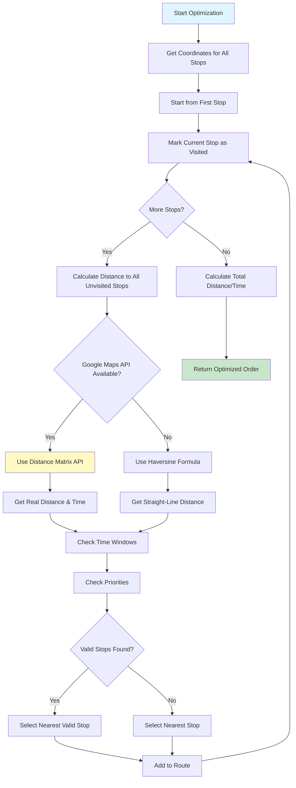

# Route Optimization Documentation

Comprehensive documentation of the route optimization algorithm, traffic data sources, and constraints.

## Overview

TruckMates uses a combination of the Nearest Neighbor algorithm and Google Maps API to optimize multi-stop routes, minimizing total distance and travel time while considering traffic conditions, time windows, and priorities.

## Algorithm

### Nearest Neighbor Algorithm

The system uses a greedy nearest neighbor approach with enhancements:

1. **Start from Origin**: Begin at the first stop (or specified origin)
2. **Find Nearest Unvisited Stop**: Calculate distance to all unvisited stops
3. **Check Constraints**: Verify time windows and priorities
4. **Select Next Stop**: Choose nearest valid stop
5. **Repeat**: Continue until all stops are visited

### Algorithm Flow



## Distance Calculation Methods

### Method 1: Google Maps Distance Matrix API (Preferred)

**When Used:**
- Google Maps API key is configured
- Real-time traffic data available
- Accurate distance and time needed

**Advantages:**
- Real road distances (not straight-line)
- Traffic-aware routing
- Accurate travel time estimates
- Considers road restrictions

**API Endpoint:**
```
https://maps.googleapis.com/maps/api/distancematrix/json
```

**Parameters:**
- `origins`: Origin coordinates or address
- `destinations`: Destination coordinates or address
- `units`: imperial (miles) or metric (kilometers)
- `key`: Google Maps API key

**Response:**
```json
{
  "rows": [{
    "elements": [{
      "distance": { "value": 16093, "text": "10.0 mi" },
      "duration": { "value": 1200, "text": "20 mins" },
      "status": "OK"
    }]
  }]
}
```

### Method 2: Haversine Formula (Fallback)

**When Used:**
- Google Maps API key not configured
- Quick distance estimation needed
- Straight-line distance acceptable

**Formula:**
```
a = sin²(Δlat/2) + cos(lat1) × cos(lat2) × sin²(Δlon/2)
c = 2 × atan2(√a, √(1-a))
distance = R × c
```

Where:
- `R` = Earth's radius (3,959 miles)
- `Δlat` = latitude difference in radians
- `Δlon` = longitude difference in radians

**Advantages:**
- No API calls required
- Fast calculation
- Works offline

**Limitations:**
- Straight-line distance (not road distance)
- No traffic consideration
- Less accurate for long distances

## Geocoding

### Address to Coordinates

**API:** Google Maps Geocoding API

**Endpoint:**
```
https://maps.googleapis.com/maps/api/geocode/json
```

**Process:**
1. User provides address string
2. System calls Geocoding API
3. API returns coordinates (lat, lng)
4. Coordinates cached for future use

**Example:**
```
Input: "123 Main St, New York, NY 10001"
Output: { lat: 40.7128, lng: -74.0060 }
```

## Constraints

### Time Windows

**Definition:** Preferred delivery/pickup time ranges for stops.

**Format:**
- `timeWindowStart`: Start time (HH:MM format)
- `timeWindowEnd`: End time (HH:MM format)

**Handling:**
1. System calculates estimated arrival time for each stop
2. Checks if arrival time falls within time window
3. Prioritizes stops with time windows
4. Adjusts route order to meet time windows when possible

**Example:**
```typescript
{
  id: "stop-1",
  address: "123 Main St",
  timeWindowStart: "09:00",
  timeWindowEnd: "12:00"
}
```

### Priorities

**Definition:** Stop priority levels (1 = highest, 5 = lowest).

**Handling:**
1. Higher priority stops are visited first
2. Within same priority, nearest neighbor applies
3. Priority overrides distance when significant difference

**Example:**
```typescript
{
  id: "stop-1",
  address: "123 Main St",
  priority: 1  // High priority - visit first
}
```

### Traffic Data

**Source:** Google Maps Distance Matrix API (real-time traffic)

**Features:**
- Current traffic conditions
- Historical traffic patterns
- Traffic-aware routing
- Estimated travel time with traffic

**When Available:**
- Google Maps API key configured
- Traffic data enabled in API request
- Real-time data for current time
- Historical data for future times

## Optimization Process

### Step-by-Step

1. **Input Validation**
   - Verify at least 2 stops
   - Validate addresses
   - Check for coordinates

2. **Geocoding**
   - Convert addresses to coordinates
   - Cache coordinates for performance

3. **Distance Matrix Calculation**
   - Calculate distances between all stops
   - Use Google Maps API if available
   - Fallback to Haversine if not

4. **Route Optimization**
   - Apply nearest neighbor algorithm
   - Consider time windows
   - Respect priorities
   - Minimize total distance

5. **Time Estimation**
   - Calculate total travel time
   - Include traffic delays (if API available)
   - Estimate arrival times

6. **Result Return**
   - Optimized stop order
   - Total distance
   - Estimated time
   - API usage indicator

## API Reference

### Optimize Route Order

**Endpoint:** Server Action `optimizeRouteOrder(stops)`

**Parameters:**
```typescript
stops: Array<{
  id: string,                    // Unique stop identifier
  address: string,                // Address string
  lat?: number,                   // Optional: Latitude
  lng?: number,                   // Optional: Longitude
  priority?: number,              // Optional: Priority (1-5)
  timeWindowStart?: string,       // Optional: Start time (HH:MM)
  timeWindowEnd?: string          // Optional: End time (HH:MM)
}>
```

**Returns:**
```typescript
{
  optimizedOrder: Array<{
    id: string,                   // Stop ID
    order: number                  // Visit order (1, 2, 3, ...)
  }>,
  totalDistance: number,           // Total distance in miles
  estimatedTime: number,           // Estimated time in minutes
  useAPI: boolean                  // Whether Google Maps API was used
}
```

**Example:**
```typescript
const stops = [
  { id: "1", address: "123 Main St, New York, NY" },
  { id: "2", address: "456 Oak Ave, Brooklyn, NY", priority: 1 },
  { id: "3", address: "789 Pine St, Queens, NY", timeWindowStart: "14:00", timeWindowEnd: "16:00" }
]

const result = await optimizeRouteOrder(stops)
// Returns optimized order with distances and times
```

## Performance

### Optimization Time

- **2-5 stops**: < 1 second
- **5-10 stops**: 1-3 seconds
- **10-20 stops**: 3-10 seconds
- **20+ stops**: 10-30 seconds (may timeout)

### Factors Affecting Performance

1. **Number of Stops**: More stops = longer calculation
2. **API Availability**: Google Maps API faster than Haversine (fewer calculations)
3. **Geocoding**: Address geocoding adds time
4. **Time Windows**: Complex time window constraints increase calculation time

### Optimization

- **Caching**: Coordinates cached to avoid re-geocoding
- **Batch API Calls**: Multiple distances calculated in single API call when possible
- **Parallel Processing**: Geocoding done in parallel for all stops

## Limitations

### Current Limitations

1. **No Multi-Vehicle Optimization**: Optimizes single route only
2. **No Capacity Constraints**: Doesn't consider vehicle capacity
3. **No Weight Restrictions**: Doesn't avoid weight-restricted roads
4. **No Height Restrictions**: Doesn't avoid low bridges
5. **No Fuel Optimization**: Doesn't optimize for fuel stops
6. **No Toll Consideration**: Doesn't factor toll costs

### Planned Enhancements

1. **Multi-Vehicle Optimization**: Optimize routes for multiple vehicles
2. **Capacity Constraints**: Consider vehicle capacity and load weight
3. **Weight/Height Routing**: Avoid restricted roads
4. **Fuel Optimization**: Include fuel stops in optimization
5. **Toll Cost Calculation**: Factor toll costs into optimization
6. **Advanced Algorithms**: Implement genetic algorithms or simulated annealing

## Traffic Data Source

### Google Maps Traffic Data

**Source:** Google Maps Distance Matrix API

**Data Types:**
- **Current Traffic**: Real-time traffic conditions
- **Historical Traffic**: Average traffic for time of day
- **Predicted Traffic**: Forecasted traffic conditions

**Update Frequency:**
- Real-time: Updated every few minutes
- Historical: Based on historical patterns
- Predicted: Based on current conditions and patterns

**Accuracy:**
- Current traffic: High accuracy
- Historical traffic: Good accuracy for typical patterns
- Predicted traffic: Moderate accuracy

## Example Scenarios

### Scenario 1: Simple Route (No Constraints)

**Stops:**
- Stop 1: "123 Main St, New York, NY"
- Stop 2: "456 Oak Ave, Brooklyn, NY"
- Stop 3: "789 Pine St, Queens, NY"

**Optimization:**
1. Calculate distances between all stops
2. Start from Stop 1
3. Find nearest unvisited stop
4. Continue until all visited

**Result:**
- Optimized order: 1 → 2 → 3 (or based on actual distances)
- Total distance: Calculated based on road distances
- Estimated time: Includes traffic

### Scenario 2: With Time Windows

**Stops:**
- Stop 1: "123 Main St" (no time window)
- Stop 2: "456 Oak Ave" (time window: 10:00-12:00)
- Stop 3: "789 Pine St" (time window: 14:00-16:00)

**Optimization:**
1. Prioritize stops with time windows
2. Calculate arrival times
3. Adjust route to meet time windows
4. Optimize remaining stops

**Result:**
- Route adjusted to meet time windows
- Stops visited in order that satisfies constraints

### Scenario 3: With Priorities

**Stops:**
- Stop 1: Priority 3
- Stop 2: Priority 1 (highest)
- Stop 3: Priority 5 (lowest)

**Optimization:**
1. Visit Stop 2 first (highest priority)
2. Then optimize remaining stops by distance
3. Visit Stop 1, then Stop 3

**Result:**
- Priority respected: 2 → 1 → 3
- Distance optimized within priority levels

## Best Practices

1. **Use Google Maps API**: Enable for accurate routing
2. **Provide Coordinates**: Include lat/lng when available (faster)
3. **Set Priorities**: Use priorities for important stops
4. **Set Time Windows**: Use time windows for time-sensitive deliveries
5. **Cache Coordinates**: Cache geocoded addresses for performance
6. **Batch Optimization**: Optimize multiple routes in parallel when possible

## Integration Points

- **Load Management**: Optimizes routes for multiple loads
- **Dispatch Board**: Suggests optimized routes for dispatchers
- **Driver Mobile App**: Shows optimized route to drivers
- **Google Maps**: Uses Google Maps for geocoding and routing
- **Reports**: Route optimization data included in reports

## Future Enhancements

Planned improvements:

1. **Multi-Vehicle Optimization**: Optimize routes for entire fleet
2. **Dynamic Re-optimization**: Re-optimize as conditions change
3. **Machine Learning**: Learn from historical routes to improve optimization
4. **Real-time Updates**: Update routes based on real-time traffic
5. **Fuel Stops**: Include fuel stops in optimization
6. **Toll Optimization**: Factor toll costs into route selection


