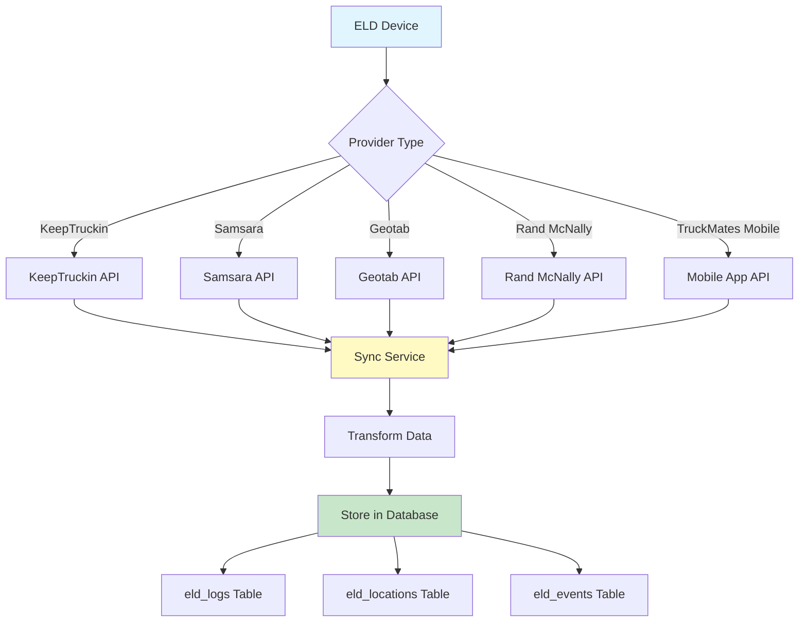

# ELD Provider Integration Documentation

Comprehensive documentation of all supported ELD (Electronic Logging Device) providers and their integration with TruckMates.

## Overview

TruckMates integrates with multiple ELD providers to sync Hours of Service (HOS) logs, GPS locations, and violation events. Each provider requires API credentials that users provide when adding their ELD devices.

## Supported Providers

1. **KeepTruckin** - Full integration
2. **Samsara** - Full integration
3. **Geotab** - Full integration
4. **Rand McNally** - Full integration
5. **TruckMates Mobile** - Native mobile app ELD

## Integration Architecture



## KeepTruckin Integration

### Overview

KeepTruckin is a leading ELD provider with comprehensive API access for HOS logs, locations, and violations.

### API Credentials

**Required:**
- API Key (`api_key`)
- API Secret (`api_secret`)

**How to Obtain:**
1. Log in to KeepTruckin dashboard
2. Navigate to Settings → API
3. Generate API credentials
4. Copy API Key and API Secret

### API Endpoints Used

1. **HOS Logs**: `https://api.keeptruckin.com/v1/logs`
2. **Locations**: `https://api.keeptruckin.com/v1/locations`
3. **Violations**: `https://api.keeptruckin.com/v1/violations`

### Authentication

**Method:** API Key + API Secret in headers

```http
X-Api-Key: <api_key>
X-Api-Secret: <api_secret>
Content-Type: application/json
```

### Data Sync

**Frequency:** Every 15 minutes (configurable)

**Data Synced:**
- HOS logs (driving, on-duty, off-duty, sleeper berth)
- GPS locations (with speed, heading, odometer)
- Violations and events

### Data Mapping

| KeepTruckin Field | TruckMates Field | Notes |
|-------------------|------------------|-------|
| `status` | `log_type` | Mapped to: driving, on_duty, off_duty, sleeper_berth |
| `date` | `log_date` | Date of log entry |
| `start_time` | `start_time` | ISO timestamp |
| `end_time` | `end_time` | ISO timestamp |
| `start_location` | `location_start` | JSONB with lat, lng, address |
| `end_location` | `location_end` | JSONB with lat, lng, address |
| `odometer_start` | `odometer_start` | Starting odometer reading |
| `odometer_end` | `odometer_end` | Ending odometer reading |
| `violations` | `violations` | Array of violation descriptions |

### Supported Features

- ✅ HOS log synchronization
- ✅ Real-time GPS location tracking
- ✅ Violation detection and reporting
- ✅ Driver mapping (provider driver ID to internal driver ID)
- ✅ Automatic sync via cron job

### Limitations

- API rate limits apply (check KeepTruckin documentation)
- Historical data sync limited by API availability
- Driver mapping requires manual configuration

---

## Samsara Integration

### Overview

Samsara provides fleet management and ELD solutions with RESTful API access.

### API Credentials

**Required:**
- API Key (`api_key`) - Bearer token

**How to Obtain:**
1. Log in to Samsara dashboard
2. Navigate to Settings → API
3. Generate API key
4. Copy API key (Bearer token)

### API Endpoints Used

1. **HOS Logs**: `https://api.samsara.com/fleet/drivers/hos_daily_logs`
2. **Locations**: `https://api.samsara.com/fleet/vehicles/locations`
3. **Events**: `https://api.samsara.com/fleet/drivers/safety/score`

### Authentication

**Method:** Bearer token

```http
Authorization: Bearer <api_key>
Content-Type: application/json
```

### Data Sync

**Frequency:** Every 15 minutes (configurable)

**Data Synced:**
- HOS daily logs
- Vehicle locations
- Safety events and violations

### Data Mapping

| Samsara Field | TruckMates Field | Notes |
|---------------|-----------------|-------|
| `dutyStatus` | `log_type` | Mapped to: driving, on_duty, off_duty, sleeper_berth |
| `logDate` | `log_date` | Date of log entry |
| `startTime` | `start_time` | ISO timestamp |
| `endTime` | `end_time` | ISO timestamp |
| `startLocation` | `location_start` | JSONB with lat, lng, address |
| `endLocation` | `location_end` | JSONB with lat, lng, address |
| `startOdometer` | `odometer_start` | Starting odometer reading |
| `endOdometer` | `odometer_end` | Ending odometer reading |

### Supported Features

- ✅ HOS log synchronization
- ✅ Real-time GPS location tracking
- ✅ Safety event detection
- ✅ Driver mapping
- ✅ Automatic sync via cron job

### Limitations

- Requires vehicle ID for location tracking
- API rate limits apply
- Some fields may vary by Samsara API version

---

## Geotab Integration

### Overview

Geotab is a telematics platform with MyGeotab API for ELD data access.

### API Credentials

**Required:**
- Username (`api_key`) - Geotab username
- Password (`api_secret`) - Geotab password
- Server URL (`provider_device_id`) - MyGeotab server URL (e.g., `https://my.geotab.com`)

**How to Obtain:**
1. Log in to MyGeotab dashboard
2. Note your server URL (e.g., `https://my.geotab.com`)
3. Use your Geotab username and password

### API Endpoints Used

1. **Authentication**: `{server}/apiv1/Authenticate`
2. **Logs**: `{server}/apiv1/Get` (typeName: "LogRecord")
3. **Locations**: `{server}/apiv1/Get` (typeName: "StatusData")
4. **Events**: `{server}/apiv1/Get` (typeName: "FaultData")

### Authentication

**Method:** Session-based authentication

```json
POST {server}/apiv1/Authenticate
{
  "userName": "<username>",
  "password": "<password>"
}
```

**Response:**
```json
{
  "result": {
    "credentials": {
      "sessionId": "<session_id>"
    }
  }
}
```

### Data Sync

**Frequency:** Every 15 minutes (configurable)

**Data Synced:**
- Log records (HOS data)
- Status data (GPS locations)
- Fault data (events/violations)

### Data Mapping

| Geotab Field | TruckMates Field | Notes |
|--------------|------------------|-------|
| `driver.id` | `driver_id` | Mapped to internal driver ID |
| `dateTime` | `log_date` | Date of log entry |
| `startTime` | `start_time` | ISO timestamp |
| `endTime` | `end_time` | ISO timestamp |
| `latitude` | `location_start.lat` | Starting latitude |
| `longitude` | `location_start.lng` | Starting longitude |

### Supported Features

- ✅ HOS log synchronization
- ✅ Real-time GPS location tracking
- ✅ Fault/event detection
- ✅ Driver mapping
- ✅ Automatic sync via cron job

### Limitations

- Requires session-based authentication (session expires)
- Server URL must be configured correctly
- API structure differs from other providers

---

## Rand McNally Integration

### Overview

Rand McNally provides ELD solutions with API access for fleet management.

### API Credentials

**Required:**
- API Key (`api_key`)
- API Secret (`api_secret`)

**How to Obtain:**
1. Contact Rand McNally support
2. Request API credentials
3. Configure in TruckMates

### API Endpoints Used

1. **HOS Logs**: `https://api.randmcnally.com/v1/logs`
2. **Locations**: `https://api.randmcnally.com/v1/locations`
3. **Events**: `https://api.randmcnally.com/v1/events`

### Authentication

**Method:** API Key + API Secret (similar to KeepTruckin)

```http
X-Api-Key: <api_key>
X-Api-Secret: <api_secret>
Content-Type: application/json
```

### Data Sync

**Frequency:** Every 15 minutes (configurable)

**Data Synced:**
- HOS logs
- GPS locations
- Violation events

### Supported Features

- ✅ HOS log synchronization
- ✅ Real-time GPS location tracking
- ✅ Violation detection
- ✅ Driver mapping
- ✅ Automatic sync via cron job

---

## TruckMates Mobile App ELD

### Overview

TruckMates provides its own mobile app ELD solution that works without third-party hardware.

### Setup

**No API Credentials Required:**
- Uses Supabase Auth for authentication
- Device registered via mobile app
- Data sent directly to TruckMates API

### API Endpoints Used

1. **Device Registration**: `POST /api/eld/mobile/register`
2. **Location Updates**: `POST /api/eld/mobile/locations`
3. **HOS Logs**: `POST /api/eld/mobile/logs`
4. **Events**: `POST /api/eld/mobile/events`

### Authentication

**Method:** Supabase Auth token

```http
Authorization: Bearer <supabase-auth-token>
Content-Type: application/json
```

### Data Sync

**Frequency:** Real-time (as events occur)

**Data Synced:**
- GPS locations (every 30 seconds when driving)
- HOS log entries (as driver changes status)
- Violation events (immediately when detected)

### Features

- ✅ No hardware required (uses phone GPS)
- ✅ Real-time tracking
- ✅ Automatic HOS violation detection
- ✅ Offline support (queues data when offline)
- ✅ Battery optimization

### Limitations

- Requires mobile app installation
- GPS accuracy depends on phone hardware
- Battery usage may be higher than dedicated ELD devices

---

## Adding an ELD Device

### Step 1: Navigate to ELD Settings

**Location:** `/dashboard/eld`

### Step 2: Click "Add Device"

### Step 3: Select Provider

Choose from:
- KeepTruckin
- Samsara
- Geotab
- Rand McNally
- TruckMates Mobile

### Step 4: Enter Device Information

**Required Fields:**
- Device Name (e.g., "Truck 1 - KeepTruckin")
- Provider Device ID (device serial number or ID from provider)
- API Credentials (varies by provider)

**Optional Fields:**
- Truck Assignment
- Installation Date
- Notes

### Step 5: Save Device

System validates credentials and creates device record.

### Step 6: Sync Data

**Automatic:**
- First sync occurs immediately
- Subsequent syncs every 15 minutes (via cron)

**Manual:**
- Click "Sync Now" button on device card

## Data Synchronization

### Sync Process

1. **Retrieve Data**: Fetch data from provider API
2. **Transform Data**: Map provider fields to TruckMates schema
3. **Store Data**: Insert/update records in database
4. **Update Timestamp**: Set `last_sync_at` on device

### Sync Frequency

- **Automatic**: Every 15 minutes (configurable)
- **Manual**: On-demand via "Sync Now" button
- **Real-time**: TruckMates Mobile app (as events occur)

### Sync Scope

**HOS Logs:**
- Last 7 days (configurable)
- New logs since last sync

**Locations:**
- Last 24 hours (configurable)
- New locations since last sync

**Events:**
- Last 7 days (configurable)
- New events since last sync

## Driver Mapping

### Overview

Provider driver IDs must be mapped to internal TruckMates driver IDs.

### Automatic Mapping

System attempts automatic mapping based on:
- Driver name matching
- Driver license number
- Email address

### Manual Mapping

If automatic mapping fails:
1. Navigate to ELD device settings
2. Click "Map Drivers"
3. Select provider driver ID
4. Select internal TruckMates driver
5. Save mapping

### Mapping Storage

Mappings stored in `eld_driver_mappings` table:
- `eld_device_id`: ELD device UUID
- `provider_driver_id`: Driver ID from provider
- `internal_driver_id`: Driver UUID in TruckMates
- `provider`: Provider name (keeptruckin, samsara, etc.)

## Error Handling

### Common Errors

1. **Invalid API Credentials**
   - Error: "API authentication failed"
   - Solution: Verify credentials in provider dashboard

2. **Device Not Found**
   - Error: "Device not found in provider system"
   - Solution: Verify provider device ID

3. **Rate Limit Exceeded**
   - Error: "API rate limit exceeded"
   - Solution: Wait for rate limit reset or upgrade API plan

4. **Network Error**
   - Error: "Failed to connect to provider API"
   - Solution: Check internet connection and provider API status

### Error Recovery

- System logs all errors
- Failed syncs are retried automatically
- Manual sync available if automatic sync fails

## Best Practices

1. **Credential Security**: Store API credentials securely (encrypted)
2. **Regular Syncs**: Ensure automatic sync is enabled
3. **Driver Mapping**: Map all drivers before first sync
4. **Monitor Sync Status**: Check `last_sync_at` regularly
5. **Error Handling**: Review error logs if syncs fail

## API Reference

### Sync All Devices

**Endpoint:** Server Action `syncAllELDDevices()`

**Process:**
1. Retrieves all active ELD devices
2. Syncs each device with its provider
3. Returns summary of synced devices

**Returns:**
```typescript
{
  data: {
    synced: number,
    failed: number,
    devices: Array<{
      device_id: string,
      provider: string,
      status: "success" | "error",
      error?: string
    }>
  },
  error: string | null
}
```

### Sync Single Device

**Endpoint:** Server Action `syncELDDevice(deviceId)`

**Parameters:**
- `deviceId` (string, required): ELD device UUID

**Returns:**
```typescript
{
  data: {
    logs: number,
    locations: number,
    events: number
  },
  error: string | null
}
```

## Troubleshooting

### Device Not Syncing

1. Check API credentials are correct
2. Verify device is active in provider dashboard
3. Check `last_sync_at` timestamp
4. Review error logs
5. Try manual sync

### Missing Data

1. Check sync frequency settings
2. Verify date range for sync
3. Check driver mapping
4. Review provider API documentation for data availability

### Data Not Appearing

1. Check driver mapping
2. Verify data is being synced (check `last_sync_at`)
3. Check filters in dashboard
4. Verify date range

## Future Enhancements

Planned improvements:

1. **Webhook Support**: Real-time data via webhooks (instead of polling)
2. **More Providers**: Additional ELD provider integrations
3. **Advanced Mapping**: Automatic driver mapping using ML
4. **Sync Scheduling**: Customizable sync schedules per device
5. **Data Validation**: Enhanced data validation and error reporting


