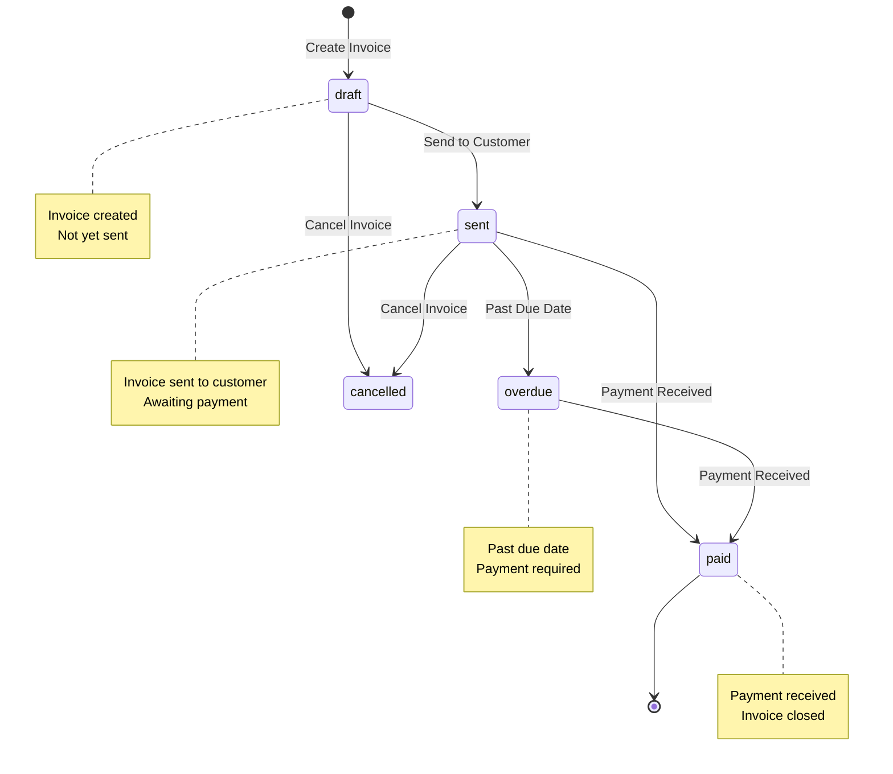
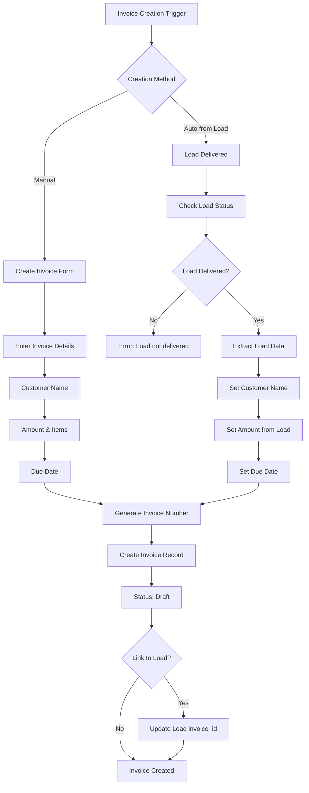
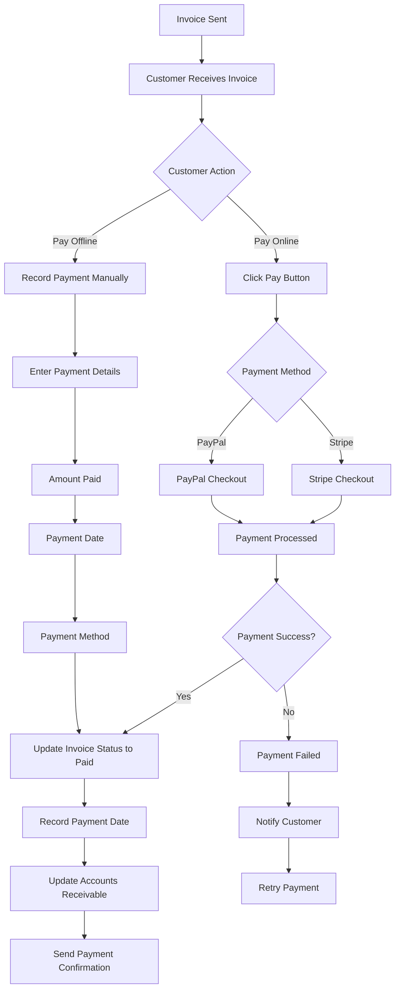
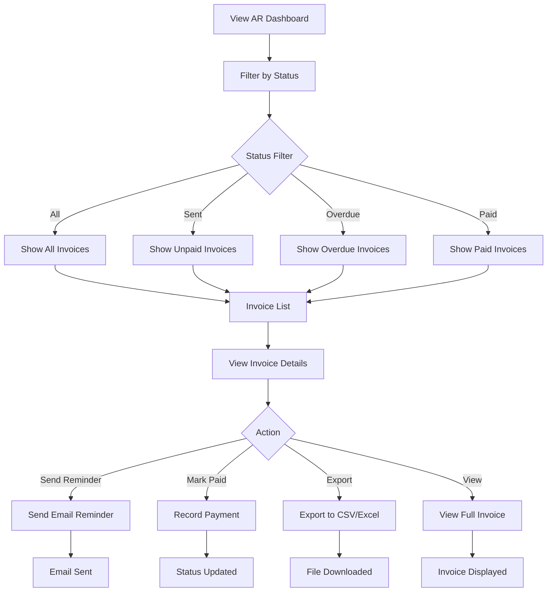
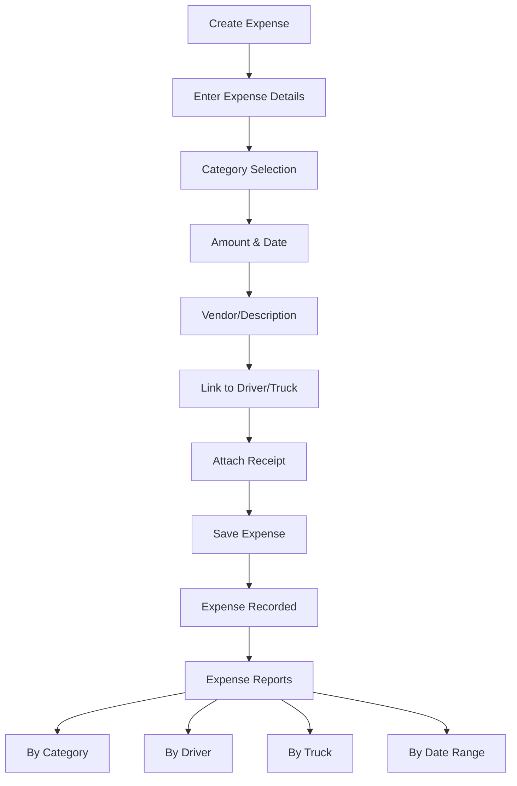

# AR/AP (Accounts Receivable / Accounts Payable) Workflow

Documentation of invoice creation, payment tracking, and accounts receivable/payable workflows.

## Overview

TruckMates manages the complete invoice lifecycle from creation to payment, including automatic invoice generation from delivered loads, payment tracking, and accounts receivable management.

## Invoice Lifecycle



## Invoice Creation Workflow



## Invoice Status Workflow

### Status Definitions

| Status | Description | Actions Available |
|--------|-------------|-------------------|
| **draft** | Invoice created but not sent | Edit, Send, Delete, Cancel |
| **sent** | Invoice sent to customer | View, Mark Paid, Resend, Cancel |
| **paid** | Payment received | View, Download, Export |
| **overdue** | Past due date, not paid | View, Send Reminder, Mark Paid |
| **cancelled** | Invoice cancelled | View, Delete |

### Status Transitions

1. **draft → sent**
   - Trigger: User clicks "Send Invoice"
   - Action: Email sent to customer, status updated

2. **sent → paid**
   - Trigger: User marks as paid OR payment received via Stripe/PayPal
   - Action: Status updated, payment date recorded

3. **sent → overdue**
   - Trigger: Due date passes, status still "sent"
   - Action: Status automatically updated (via scheduled job or on view)

4. **any → cancelled**
   - Trigger: User cancels invoice
   - Action: Status updated, invoice marked as cancelled

## Payment Processing Workflow



## Accounts Receivable Workflow



## Invoice Generation Methods

### 1. Automatic from Load

**Trigger:** Load status changes to "delivered"

**Process:**
1. System checks if load has `invoice_id` (already has invoice)
2. If no invoice, checks if auto-generate is enabled
3. Extracts load data:
   - Customer name from load
   - Amount from load value/revenue
   - Description: "Invoice for load [shipment_number]"
4. Creates invoice with:
   - Status: "draft"
   - Due date: 30 days from today (configurable)
   - Payment terms: "Net 30"
5. Links invoice to load via `invoice_id`

**Settings:**
- Enable/disable in company settings
- Default due date period (30 days)
- Default payment terms

### 2. Manual Creation

**Process:**
1. User navigates to "Create Invoice"
2. Enters invoice details:
   - Customer name
   - Invoice items/line items
   - Amount
   - Due date
   - Payment terms
3. Optionally links to load
4. Saves invoice (status: "draft")

### 3. Bulk Generation

**Process:**
1. User navigates to "Auto-Generate Invoices"
2. System finds all delivered loads without invoices
3. Generates invoice for each load
4. Returns summary:
   - Number generated
   - Errors (if any)

## Payment Recording

### Online Payment (Stripe/PayPal)

**Flow:**
1. Customer clicks "Pay Invoice" button
2. Redirected to Stripe/PayPal checkout
3. Payment processed
4. Webhook received:
   - Stripe: `/api/webhooks/stripe`
   - PayPal: `/api/webhooks/paypal`
5. Invoice status updated to "paid"
6. Payment date recorded

### Manual Payment Recording

**Flow:**
1. User clicks "Mark as Paid" on invoice
2. Enter payment details:
   - Amount paid
   - Payment date
   - Payment method (check, wire, cash, etc.)
   - Reference number (optional)
3. Save payment
4. Invoice status updated to "paid"

## Overdue Invoice Handling

### Automatic Detection

**Process:**
1. System checks invoices daily (via cron or on view)
2. Finds invoices where:
   - Status = "sent"
   - Due date < today
3. Updates status to "overdue"

### Overdue Notifications

**Options:**
1. **Email Reminders**: Send automatic reminders (if configured)
2. **Dashboard Alerts**: Show overdue count
3. **Manual Follow-up**: Manager contacts customer

## Invoice Sending

### Email Sending

**Process:**
1. User clicks "Send Invoice"
2. System generates invoice PDF (if not exists)
3. Sends email via Resend API:
   - To: Customer email
   - Subject: "Invoice [invoice_number] from [company_name]"
   - Body: Invoice details + PDF attachment
4. Updates status to "sent"
5. Records sent date

### Email Template

**Includes:**
- Company information
- Invoice number and date
- Due date
- Line items
- Total amount
- Payment instructions
- PDF attachment

## Accounts Payable (Expenses)

While TruckMates primarily focuses on Accounts Receivable (invoices), expenses are tracked separately:

### Expense Workflow



## Reporting

### AR Reports

1. **Aging Report**: Invoices by age (current, 30 days, 60 days, 90+ days)
2. **Collection Report**: Payment collection statistics
3. **Revenue Report**: Total invoiced vs. paid by period
4. **Customer Statement**: All invoices for a customer

### AP Reports

1. **Expense Report**: Expenses by category, driver, truck
2. **Fuel Report**: Fuel expenses with mileage
3. **Maintenance Report**: Maintenance expenses by truck

## Database Schema

### invoices Table

```sql
CREATE TABLE invoices (
  id UUID PRIMARY KEY,
  company_id UUID,
  invoice_number TEXT UNIQUE,
  customer_name TEXT,
  amount DECIMAL(10,2),
  status TEXT, -- 'draft', 'sent', 'paid', 'overdue', 'cancelled'
  issue_date DATE,
  due_date DATE,
  paid_date DATE,
  payment_method TEXT,
  load_id UUID, -- Linked load
  created_at TIMESTAMP,
  updated_at TIMESTAMP
);
```

### expenses Table

```sql
CREATE TABLE expenses (
  id UUID PRIMARY KEY,
  company_id UUID,
  category TEXT, -- 'fuel', 'maintenance', 'tolls', etc.
  description TEXT,
  amount DECIMAL(10,2),
  date DATE,
  driver_id UUID,
  truck_id UUID,
  receipt_url TEXT,
  created_at TIMESTAMP
);
```

## API Reference

### Create Invoice

**Endpoint:** Server Action `createInvoice(formData)`

**Parameters:**
```typescript
{
  customer_name: string,
  amount: number,
  issue_date: string,
  due_date: string,
  payment_terms?: string,
  description?: string,
  load_id?: string
}
```

### Send Invoice

**Endpoint:** Server Action `sendInvoice(invoiceId)`

**Process:**
- Generates PDF
- Sends email via Resend
- Updates status to "sent"

### Mark Invoice Paid

**Endpoint:** Server Action `updateInvoice(id, { status: "paid", paid_date, payment_method })`

## Best Practices

1. **Auto-Generate**: Enable auto-generation for faster invoice creation
2. **Payment Terms**: Set clear payment terms (Net 30, Net 15, etc.)
3. **Follow-up**: Send reminders for overdue invoices
4. **Documentation**: Attach receipts to expenses
5. **Reconciliation**: Regularly reconcile AR with bank deposits

## Integration Points

- **Load Management**: Auto-generates invoices from delivered loads
- **Email Service**: Sends invoices via Resend API
- **Payment Processing**: Integrates with Stripe and PayPal
- **QuickBooks**: Syncs invoices and expenses (if configured)
- **Reports**: Included in financial reports and analytics


