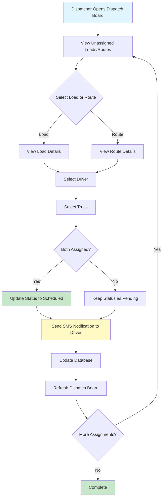

# Dispatcher Workflow

Visual workflow diagram and documentation for the dispatcher assignment process.

## Overview

The dispatcher workflow allows managers to quickly assign drivers and trucks to unassigned loads and routes. The system supports both manual assignment and automatic suggestions based on historical data.

## Workflow Diagram



## Detailed Steps

### Step 1: Access Dispatch Board

**Location:** `/dashboard/dispatches`

**What Displays:**
- Unassigned loads (no driver or truck assigned, or status = "pending")
- Unassigned routes (no driver or truck assigned, or status = "pending")
- Available drivers (status = "active")
- Available trucks (status = "available" or "in_use")

### Step 2: Select Load or Route

**Options:**
- Click on a load card to view details
- Click on a route card to view details
- Use quick assignment dropdowns directly from the list

### Step 3: Assign Driver

**Options:**
- Select from dropdown of active drivers
- System suggests drivers based on:
  - Recent loads to same origin/destination
  - Driver availability
  - Driver location (if GPS data available)

**Auto-Assignment Logic:**
If auto-assignment is enabled in settings:
1. System looks for recent loads to same origin/destination
2. Finds most frequently used driver for that route
3. Suggests that driver automatically

### Step 4: Assign Truck

**Options:**
- Select from dropdown of available trucks
- System suggests trucks based on:
  - Recent loads to same origin/destination
  - Truck availability
  - Truck location (if GPS data available)

**Auto-Assignment Logic:**
If auto-assignment is enabled:
1. System looks for recent loads to same origin/destination
2. Finds most frequently used truck for that route
3. Suggests that truck automatically

### Step 5: Status Update

**Automatic Status Changes:**
- If both driver AND truck assigned AND status is "pending" → Status changes to "scheduled"
- If only driver OR truck assigned → Status remains "pending"

### Step 6: Notification

**SMS Notification:**
- Automatically sent to driver when assigned
- Message includes: Load number, route info (origin → destination)
- Non-blocking (doesn't fail assignment if SMS fails)

**Email Notification:**
- Optional email notification (if Resend API configured)
- Sent to driver's email address

### Step 7: Database Update

**Updates:**
- Load/Route record updated with:
  - `driver_id`
  - `truck_id`
  - `status` (if both assigned)
  - `updated_at` timestamp

### Step 8: Refresh

**Automatic:**
- Dispatch board refreshes automatically
- Assigned loads/routes removed from unassigned list
- Available drivers/trucks updated

## Quick Assignment

For faster assignment, use the quick assignment feature:

1. Click "Quick Assign" button on load/route card
2. Select driver from dropdown
3. Select truck from dropdown
4. Click "Assign"
5. System updates and sends notifications

## Auto-Assignment Settings

Configure auto-assignment in Dispatch Settings (`/dashboard/settings/dispatch`):

- **Auto-Assign Driver**: Automatically suggest driver based on route history
- **Auto-Assign Truck**: Automatically suggest truck based on route history

## Assignment Rules

### Driver Assignment Rules

- Driver must be "active" status
- Driver must belong to same company
- System validates driver exists before assignment

### Truck Assignment Rules

- Truck must be "available" or "in_use" status
- Truck must belong to same company
- System validates truck exists before assignment

### Status Rules

| Condition | Status |
|-----------|--------|
| No driver, no truck | `pending` |
| Driver only | `pending` |
| Truck only | `pending` |
| Driver + Truck | `scheduled` |

## Error Handling

### Common Errors

1. **Driver Not Found**
   - Error: "Invalid driver selected"
   - Solution: Select a valid active driver

2. **Truck Not Found**
   - Error: "Invalid truck selected"
   - Solution: Select a valid available truck

3. **Driver Inactive**
   - Error: "Cannot assign inactive driver to load"
   - Solution: Activate driver first

4. **Truck Unavailable**
   - Error: "Cannot assign truck with status: [status]"
   - Solution: Select available truck

## API Reference

### Quick Assign Load

**Endpoint:** Server Action `quickAssignLoad(loadId, driverId?, truckId?)`

**Parameters:**
- `loadId` (string, required): Load UUID
- `driverId` (string, optional): Driver UUID
- `truckId` (string, optional): Truck UUID

**Returns:**
```typescript
{
  data: Load,
  error: string | null
}
```

### Quick Assign Route

**Endpoint:** Server Action `quickAssignRoute(routeId, driverId?, truckId?)`

**Parameters:**
- `routeId` (string, required): Route UUID
- `driverId` (string, optional): Driver UUID
- `truckId` (string, optional): Truck UUID

**Returns:**
```typescript
{
  data: Route,
  error: string | null
}
```

## Best Practices

1. **Batch Assignments**: Assign multiple loads/routes in one session
2. **Verify Availability**: Check driver and truck availability before assignment
3. **Use Auto-Suggestions**: Leverage auto-assignment for faster workflow
4. **Notify Drivers**: Ensure SMS notifications are working for driver communication
5. **Review Assignments**: Double-check assignments before finalizing

## Integration Points

- **Driver Management**: Pulls from `drivers` table
- **Truck Management**: Pulls from `trucks` table
- **Load Management**: Updates `loads` table
- **Route Management**: Updates `routes` table
- **SMS Notifications**: Integrates with Twilio (if configured)
- **Email Notifications**: Integrates with Resend (if configured)


