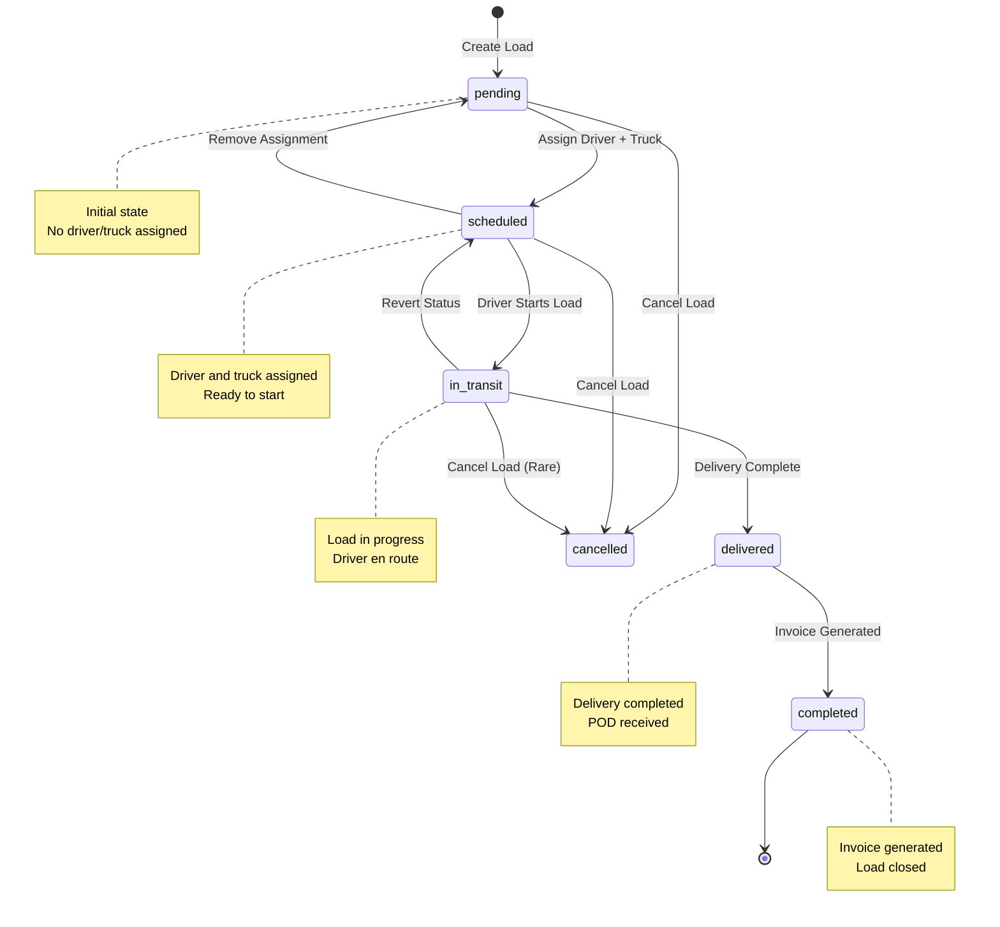
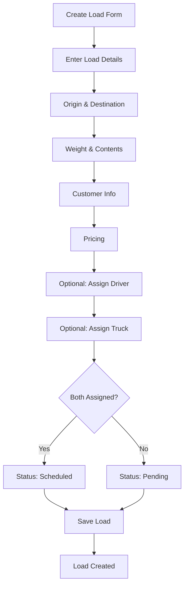
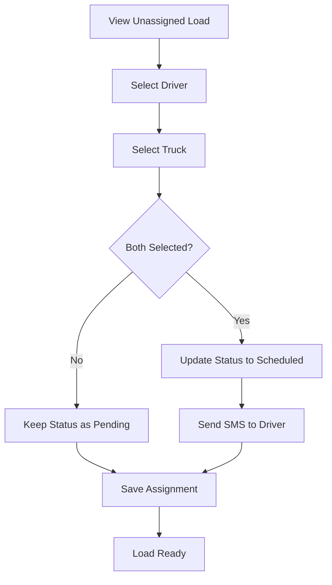
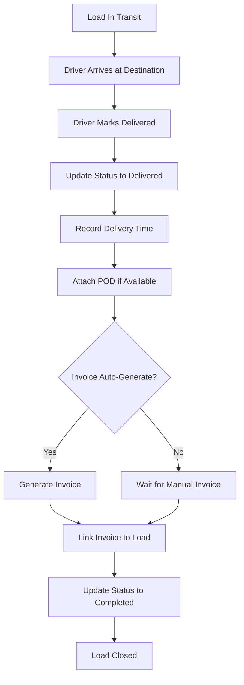

# Load Lifecycle Workflow

Documentation of load status transitions and lifecycle management.

## Overview

Loads in TruckMates progress through a defined lifecycle from creation to completion. Each status change triggers specific actions and updates related records.

## Status Transition Diagram



## Status Definitions

### 1. Pending

**Definition:** Load created but not yet assigned to driver/truck.

**Characteristics:**
- No driver assigned OR
- No truck assigned OR
- Explicitly set to "pending" status

**Actions Available:**
- Assign driver
- Assign truck
- Edit load details
- Cancel load
- Delete load (if no assignments)

**Next States:**
- `scheduled` - When both driver and truck are assigned
- `cancelled` - If load is cancelled

### 2. Scheduled

**Definition:** Load assigned to driver and truck, ready to start.

**Characteristics:**
- Driver assigned
- Truck assigned
- Status = "scheduled"
- Load date set (if provided)

**Actions Available:**
- Start load (change to in_transit)
- Remove assignment (revert to pending)
- Edit load details
- Cancel load
- View driver/truck details

**Next States:**
- `in_transit` - When driver starts the load
- `pending` - If assignment is removed
- `cancelled` - If load is cancelled

### 3. In Transit

**Definition:** Load is actively being transported.

**Characteristics:**
- Driver is en route
- Load is in progress
- Real-time tracking available (if ELD/GPS enabled)
- Estimated delivery time tracked

**Actions Available:**
- Update status to delivered
- Add delivery notes
- Update location (if GPS not available)
- Cancel load (rare, only if necessary)

**Next States:**
- `delivered` - When delivery is completed
- `scheduled` - If status needs to be reverted (rare)
- `cancelled` - If load is cancelled (rare)

### 4. Delivered

**Definition:** Load has been delivered to destination.

**Characteristics:**
- Delivery completed
- Proof of Delivery (POD) may be attached
- Actual delivery date/time recorded
- Ready for invoice generation

**Actions Available:**
- Generate invoice (auto or manual)
- Add delivery notes
- Attach POD document
- Mark as completed

**Next States:**
- `completed` - When invoice is generated or manually marked complete
- `cancelled` - If delivery issues require cancellation (rare)

### 5. Completed

**Definition:** Load is fully closed, invoice generated.

**Characteristics:**
- Invoice created (linked via `invoice_id`)
- All documentation complete
- Load closed for accounting
- Historical record maintained

**Actions Available:**
- View invoice
- View load history
- Export load data
- No further status changes

**Next States:**
- None (terminal state)

### 6. Cancelled

**Definition:** Load was cancelled before or during transport.

**Characteristics:**
- Load will not be completed
- May have cancellation reason
- Driver/truck assignments removed
- No invoice generated

**Actions Available:**
- View cancellation details
- Delete load (if appropriate)
- No further status changes

**Next States:**
- None (terminal state)

## Status Transition Rules

### Automatic Transitions

1. **Pending → Scheduled**
   - Trigger: Both driver AND truck assigned
   - Condition: Current status is "pending"
   - Action: Status automatically updated

2. **Scheduled → In Transit**
   - Trigger: Manual status update or driver starts via mobile app
   - Condition: Current status is "scheduled"
   - Action: Status updated, tracking begins

3. **In Transit → Delivered**
   - Trigger: Manual status update or driver marks delivered via mobile app
   - Condition: Current status is "in_transit"
   - Action: Status updated, delivery date recorded

4. **Delivered → Completed**
   - Trigger: Invoice generated (auto or manual)
   - Condition: Current status is "delivered"
   - Action: Status updated, invoice linked

### Manual Transitions

1. **Any → Cancelled**
   - Trigger: User clicks "Cancel Load"
   - Condition: Any status except "completed"
   - Action: Status set to "cancelled", assignments removed

2. **Scheduled → Pending**
   - Trigger: Driver or truck assignment removed
   - Condition: Current status is "scheduled"
   - Action: Status reverted to "pending"

## Workflow Details

### Load Creation Flow



### Load Assignment Flow



### Load Delivery Flow



## Status Fields

Each load has the following status-related fields:

- `status`: Current status (pending, scheduled, in_transit, delivered, completed, cancelled)
- `driver_id`: Assigned driver UUID (nullable)
- `truck_id`: Assigned truck UUID (nullable)
- `load_date`: Scheduled load date
- `estimated_delivery`: Estimated delivery date/time
- `actual_delivery`: Actual delivery date/time (set when delivered)
- `invoice_id`: Linked invoice UUID (set when invoice generated)

## Status Change Triggers

### Automatic Triggers

1. **Assignment Complete**
   - When both driver_id and truck_id are set
   - Status changes from "pending" to "scheduled"

2. **Invoice Generated**
   - When invoice is created and linked to load
   - Status changes from "delivered" to "completed"

### Manual Triggers

1. **User Updates Status**
   - Via load detail page
   - Via bulk status update
   - Via API

2. **Driver Updates via Mobile App**
   - Driver can update status from mobile app
   - Requires authentication and device registration

## Database Schema

```sql
CREATE TABLE loads (
  id UUID PRIMARY KEY,
  company_id UUID,
  shipment_number TEXT,
  status TEXT DEFAULT 'pending',
  driver_id UUID,
  truck_id UUID,
  load_date DATE,
  estimated_delivery TIMESTAMP,
  actual_delivery TIMESTAMP,
  invoice_id UUID,
  -- ... other fields
);
```

## API Reference

### Update Load Status

**Endpoint:** Server Action `updateLoad(id, { status })`

**Example:**
```typescript
await updateLoad(loadId, {
  status: "in_transit"
})
```

### Get Loads by Status

**Endpoint:** Server Action `getLoads({ status })`

**Example:**
```typescript
const result = await getLoads({
  status: "pending"
})
```

## Best Practices

1. **Status Consistency**: Always update status in correct order
2. **Delivery Tracking**: Record actual delivery time for accurate reporting
3. **Invoice Linking**: Ensure invoice is linked when load is completed
4. **Status History**: Maintain audit trail of status changes
5. **Bulk Updates**: Use bulk status update for multiple loads

## Integration Points

- **Dispatch Board**: Shows loads by status
- **Driver Mobile App**: Drivers can update status
- **Invoice Generation**: Auto-generates invoice when delivered
- **Reports**: Status used in load reports and analytics
- **Notifications**: Status changes trigger notifications


