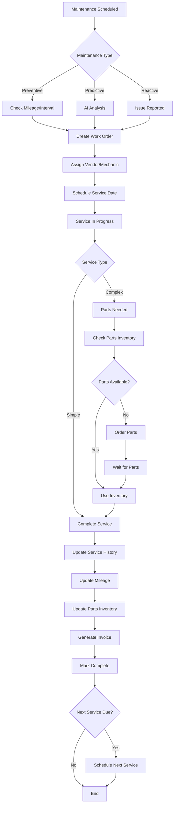

# Maintenance Service Workflow
TruckMates Platform - Vehicle Maintenance Service Process

## Overview

This document outlines the complete workflow for vehicle maintenance services in TruckMates, from initial scheduling through completion and documentation.

---

## Workflow Diagram



---

## Workflow Steps

### 1. Maintenance Scheduling

**Triggers:**
- **Preventive**: Mileage-based intervals (oil change at 10k, tire rotation at 15k, etc.)
- **Predictive**: AI analysis based on mileage, history, and patterns
- **Reactive**: Driver reports issue, DVIR inspection, or breakdown

**Actions:**
- System automatically creates maintenance record
- Sets priority (high/medium/low)
- Estimates cost based on service type
- Schedules service date (if vendor available)

---

### 2. Work Order Creation

**Information Captured:**
- Vehicle information (truck ID, VIN, current mileage)
- Service type (oil change, tire rotation, brake inspection, etc.)
- Service description
- Estimated cost
- Priority level
- Scheduled date/time
- Vendor/mechanic assignment

**Status**: `scheduled`

---

### 3. Vendor/Mechanic Assignment

**Options:**
- **Internal**: Company mechanic
- **External**: Vendor/garage
- **Mobile**: Mobile service provider

**Assignment Process:**
1. Check vendor availability
2. Assign based on:
   - Service type expertise
   - Location proximity
   - Cost estimates
   - Vendor ratings
3. Send notification to vendor
4. Update work order with vendor details

---

### 4. Parts Inventory Check

**For Services Requiring Parts:**

1. **Check Inventory**:
   - Query parts inventory
   - Check availability
   - Verify part compatibility

2. **If Parts Available**:
   - Reserve parts for service
   - Update inventory (reduce quantity)
   - Create part usage record

3. **If Parts Not Available**:
   - Create parts order
   - Set order status to "pending"
   - Notify purchasing department
   - Delay service until parts arrive

---

### 5. Service Execution

**Service In Progress:**

- **Status**: `in_progress`
- **Updates**:
  - Actual start time
  - Service notes
  - Parts used (tracked in inventory)
  - Labor hours
  - Additional issues found

**Service Types:**

- **Simple Services** (1-2 hours):
  - Oil change
  - Tire rotation
  - Fluid top-off
  - Basic inspection

- **Complex Services** (4+ hours):
  - Brake replacement
  - Engine repair
  - Transmission service
  - Major component replacement

---

### 6. Service Completion

**Completion Checklist:**

- [ ] Service performed
- [ ] Parts installed (if applicable)
- [ ] Quality check completed
- [ ] Test drive performed (if applicable)
- [ ] Service notes documented
- [ ] Mileage updated
- [ ] Cost recorded

**Status**: `completed`

---

### 7. Service History Update

**Records Updated:**

1. **Maintenance Record**:
   - Actual completion date
   - Actual cost
   - Service notes
   - Parts used
   - Labor hours
   - Vendor information

2. **Vehicle Record**:
   - Last service date
   - Last service mileage
   - Next service due date
   - Next service mileage

3. **Parts Inventory**:
   - Parts usage recorded
   - Inventory quantities updated
   - Reorder alerts triggered (if needed)

---

### 8. Invoice Generation

**Invoice Details:**

- Service description
- Parts cost
- Labor cost
- Tax
- Total amount
- Vendor information
- Payment terms

**Integration:**
- Auto-generate invoice
- Link to accounting system
- Send to vendor (if external)
- Track payment status

---

### 9. Next Service Scheduling

**Automatic Scheduling:**

After service completion, system:
1. Calculates next service due date/mileage
2. Creates new maintenance record
3. Sets status to `scheduled`
4. Sends reminder notifications

**Service Intervals:**
- Oil Change: Every 10,000 miles
- Tire Rotation: Every 15,000 miles
- Brake Inspection: Every 20,000 miles
- Major Service: Every 50,000 miles

---

## Status Transitions

```
scheduled → in_progress → completed
    ↓
on_hold (if parts needed or delayed)
    ↓
in_progress → completed
```

---

## Integration Points

### 1. Predictive Maintenance
- **Input**: Current mileage, maintenance history
- **Output**: Service recommendations, priority levels
- **Action**: Auto-create maintenance records

### 2. Parts Inventory
- **Input**: Parts needed for service
- **Output**: Parts reserved, inventory updated
- **Action**: Track parts usage, trigger reorders

### 3. Accounting
- **Input**: Service costs, parts costs
- **Output**: Invoices, expense records
- **Action**: Financial tracking and reporting

### 4. Vehicle Management
- **Input**: Service completion
- **Output**: Updated vehicle status, mileage
- **Action**: Vehicle availability, next service dates

---

## Notifications & Alerts

### Scheduled Notifications
- **7 days before**: Service reminder
- **3 days before**: Service reminder
- **1 day before**: Final reminder
- **On due date**: Service overdue alert

### Status Notifications
- **Service scheduled**: Notify dispatcher
- **Service started**: Notify manager
- **Service completed**: Notify manager, update driver
- **Service delayed**: Alert manager, reschedule

---

## Reporting & Analytics

### Maintenance Reports
- Service history by vehicle
- Service costs by category
- Vendor performance
- Parts usage trends
- Downtime analysis

### Predictive Analytics
- Maintenance cost forecasting
- Failure prediction
- Optimal service intervals
- Parts demand forecasting

---

## Best Practices

### 1. Preventive Maintenance
- **Schedule Early**: Don't wait until due date
- **Track Mileage**: Accurate mileage is critical
- **Follow Intervals**: Stick to manufacturer recommendations
- **Document Everything**: Detailed service notes

### 2. Parts Management
- **Maintain Inventory**: Keep common parts in stock
- **Track Usage**: Monitor parts consumption
- **Reorder Timely**: Set reorder points
- **Verify Compatibility**: Ensure parts match vehicle

### 3. Vendor Management
- **Rate Vendors**: Track quality and cost
- **Compare Options**: Get multiple quotes for major services
- **Build Relationships**: Preferred vendors for better service
- **Monitor Performance**: Track vendor reliability

### 4. Cost Control
- **Budget Planning**: Annual maintenance budgets
- **Cost Tracking**: Monitor actual vs. estimated
- **Negotiate Rates**: Bulk discounts with vendors
- **Optimize Scheduling**: Reduce downtime

---

## Related Documentation

- [Predictive Maintenance](../features/predictive-maintenance.md)
- [Parts Inventory](../features/parts-inventory.md)
- [Vehicle Management](../features/fleet-management.md)
- [Accounting Integration](../integrations/accounting.md)


