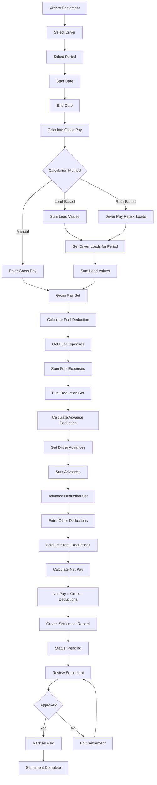

# Driver Settlement Process

Documentation of driver settlement calculation methodology and workflow.

## Overview

Driver settlements calculate driver pay for a specific period, including gross pay, deductions (fuel, advances, other), and net pay. The system automatically calculates settlements based on loads, expenses, and ELD data.

## Settlement Calculation Workflow



## Calculation Methodology

### Gross Pay Calculation

The system supports three methods for calculating gross pay:

#### Method 1: Load-Based (Default)

**Formula:**
```
Gross Pay = Sum of all load values for the period
```

**Process:**
1. Retrieve all loads for driver in period
2. Sum `value` or `total_revenue` or `estimated_revenue` from each load
3. Use sum as gross pay

**Example:**
- Load 1: $1,500
- Load 2: $2,000
- Load 3: $1,800
- **Gross Pay: $5,300**

#### Method 2: Rate-Based (Future)

**Formula:**
```
Gross Pay = Driver Pay Rate × Number of Loads
```

**Note:** Currently not fully implemented. Requires `pay_rate` column in drivers table.

#### Method 3: Manual Entry

**Process:**
1. User enters gross pay manually
2. System uses entered value
3. Load values still retrieved for reference

### Fuel Deduction Calculation

**Formula:**
```
Fuel Deduction = Sum of fuel expenses for period
```

**Process:**
1. Retrieve all expenses for driver in period
2. Filter by category = "fuel"
3. Sum all fuel expense amounts
4. Use sum as fuel deduction

**Example:**
- Fuel expense 1: $250
- Fuel expense 2: $180
- Fuel expense 3: $220
- **Fuel Deduction: $650**

**ELD Integration:**
- If ELD data available, system can also calculate fuel based on miles driven
- Miles from ELD logs × fuel cost per mile (if configured)

### Advance Deduction Calculation

**Formula:**
```
Advance Deduction = Sum of advances given to driver in period
```

**Process:**
1. Retrieve all advances for driver in period
2. Sum advance amounts
3. Use sum as advance deduction

**Note:** Advances are typically tracked separately and linked to settlements.

### Other Deductions

**Types:**
- Equipment deductions
- Insurance deductions
- Other miscellaneous deductions

**Process:**
1. User enters other deductions manually
2. System adds to total deductions

### Net Pay Calculation

**Formula:**
```
Net Pay = Gross Pay - Total Deductions

Where:
Total Deductions = Fuel Deduction + Advance Deduction + Other Deductions
```

**Example:**
- Gross Pay: $5,300
- Fuel Deduction: $650
- Advance Deduction: $200
- Other Deductions: $50
- **Total Deductions: $900**
- **Net Pay: $5,300 - $900 = $4,400**

## Settlement Workflow

### Step 1: Create Settlement

**Location:** `/dashboard/accounting/settlements/create`

**Required Fields:**
- Driver (dropdown)
- Period Start Date
- Period End Date

**Optional Fields:**
- Gross Pay (if manual entry)
- Fuel Deduction (if override needed)
- Advance Deduction (if override needed)
- Other Deductions
- Payment Method
- Notes

### Step 2: Auto-Calculate

**Process:**
1. User clicks "Calculate" button
2. System retrieves:
   - Driver loads for period
   - Fuel expenses for period
   - Advances for period (if tracked)
   - ELD mileage data (if available)
3. System calculates:
   - Gross pay
   - Fuel deduction
   - Advance deduction
   - Net pay
4. Results displayed in form

### Step 3: Review and Adjust

**Options:**
- Review calculated values
- Adjust gross pay if needed
- Adjust deductions if needed
- Add other deductions
- Add notes

### Step 4: Save Settlement

**Process:**
1. User clicks "Create Settlement"
2. System validates:
   - Driver selected
   - Period dates valid
   - Gross pay > 0
   - Net pay >= 0
3. Creates settlement record:
   - Status: "pending"
   - All calculated values stored
   - Loads linked (JSONB array)
4. Settlement saved

### Step 5: Approve and Pay

**Process:**
1. Manager reviews settlement
2. Clicks "Approve" or "Mark as Paid"
3. System updates:
   - Status: "paid"
   - Paid date: current date
   - Payment method recorded
4. Settlement closed

## Settlement Data Structure

### Settlement Record

```typescript
{
  id: string,
  company_id: string,
  driver_id: string,
  period_start: string, // YYYY-MM-DD
  period_end: string,    // YYYY-MM-DD
  gross_pay: number,
  fuel_deduction: number,
  advance_deduction: number,
  other_deductions: number,
  total_deductions: number,
  net_pay: number,
  status: "pending" | "paid" | "cancelled",
  paid_date: string | null,
  payment_method: string | null,
  loads: Array<{
    id: string,
    shipment_number: string,
    value: number,
    date: string
  }>,
  created_at: string,
  updated_at: string
}
```

## Loads Included in Settlement

### Load Selection Criteria

Loads are included if:
- `driver_id` matches settlement driver
- `load_date` or `actual_delivery` falls within period
- Load status is "delivered" or "completed"

### Load Data Stored

For each load, settlement stores:
- Load ID
- Shipment number
- Load value
- Load date

This creates a permanent record of which loads were included in the settlement.

## ELD Mileage Integration

### Mileage Calculation

If driver has ELD device:

1. Retrieve ELD logs for period
2. Filter logs where `log_type = "driving"`
3. Sum `miles_driven` from all logs
4. Store total miles in settlement metadata

**Use Cases:**
- Fuel cost per mile calculations
- Mileage-based pay (if configured)
- IFTA reporting
- Tax deductions

## Settlement Status

### Status Definitions

| Status | Description | Actions |
|--------|-------------|---------|
| **pending** | Settlement created, awaiting approval/payment | Edit, Approve, Cancel |
| **paid** | Payment processed, settlement closed | View, Download, Export |
| **cancelled** | Settlement cancelled | View, Delete |

### Status Transitions

1. **pending → paid**
   - Trigger: Manager marks as paid
   - Action: Status updated, paid_date set

2. **pending → cancelled**
   - Trigger: Manager cancels settlement
   - Action: Status updated, settlement voided

## Database Schema

```sql
CREATE TABLE settlements (
  id UUID PRIMARY KEY,
  company_id UUID,
  driver_id UUID,
  period_start DATE,
  period_end DATE,
  gross_pay DECIMAL(10,2),
  fuel_deduction DECIMAL(10,2) DEFAULT 0,
  advance_deduction DECIMAL(10,2) DEFAULT 0,
  other_deductions DECIMAL(10,2) DEFAULT 0,
  total_deductions DECIMAL(10,2),
  net_pay DECIMAL(10,2),
  status TEXT DEFAULT 'pending',
  paid_date DATE,
  payment_method TEXT,
  loads JSONB, -- Array of load data
  created_at TIMESTAMP,
  updated_at TIMESTAMP
);
```

## API Reference

### Create Settlement

**Endpoint:** Server Action `createSettlement(formData)`

**Parameters:**
```typescript
{
  driver_id: string,
  period_start: string, // YYYY-MM-DD
  period_end: string,   // YYYY-MM-DD
  gross_pay?: number,
  fuel_deduction?: number,
  advance_deduction?: number,
  other_deductions?: number,
  payment_method?: string,
  notes?: string
}
```

**Returns:**
```typescript
{
  data: Settlement,
  error: string | null
}
```

### Get Driver Loads for Period

**Endpoint:** Server Action `getDriverLoadsForPeriod(driverId, startDate, endDate)`

**Returns:**
```typescript
{
  data: Load[],
  error: string | null
}
```

### Get Driver Fuel Expenses for Period

**Endpoint:** Server Action `getDriverFuelExpensesForPeriod(driverId, startDate, endDate)`

**Returns:**
```typescript
{
  data: Expense[],
  totalFuelExpense: number,
  error: string | null
}
```

## Calculation Examples

### Example 1: Standard Settlement

**Period:** January 1-15, 2024

**Loads:**
- Load 1: $1,500 (Jan 5)
- Load 2: $2,000 (Jan 10)
- Load 3: $1,800 (Jan 12)

**Expenses:**
- Fuel: $250 (Jan 3)
- Fuel: $180 (Jan 8)
- Fuel: $220 (Jan 13)

**Advances:**
- Advance: $200 (Jan 7)

**Calculation:**
- Gross Pay: $1,500 + $2,000 + $1,800 = $5,300
- Fuel Deduction: $250 + $180 + $220 = $650
- Advance Deduction: $200
- Other Deductions: $0
- Total Deductions: $650 + $200 = $850
- **Net Pay: $5,300 - $850 = $4,450**

### Example 2: With ELD Mileage

**Period:** January 1-15, 2024

**Loads:** Same as Example 1

**ELD Data:**
- Total miles driven: 2,500 miles
- Fuel cost per mile: $0.30

**Calculation:**
- Gross Pay: $5,300
- Fuel Deduction (ELD-based): 2,500 × $0.30 = $750
- Advance Deduction: $200
- **Net Pay: $5,300 - $750 - $200 = $4,350**

## Best Practices

1. **Regular Settlements**: Process settlements weekly or bi-weekly
2. **Review Calculations**: Always review auto-calculated values
3. **Document Adjustments**: Add notes when manually adjusting
4. **Link Loads**: Ensure all loads are properly linked
5. **Track Advances**: Maintain separate advance tracking system
6. **ELD Integration**: Use ELD mileage for accurate fuel calculations

## Integration Points

- **Load Management**: Pulls load data for gross pay calculation
- **Expense Tracking**: Pulls fuel expenses for deductions
- **ELD System**: Integrates mileage data for fuel calculations
- **Driver Management**: Links to driver records
- **Reports**: Included in driver payment reports

## Future Enhancements

Planned improvements:

1. **Pay Rate System**: Implement driver pay rates (per mile, per load, percentage)
2. **Advance Tracking**: Built-in advance management system
3. **Automatic Settlements**: Auto-generate settlements at period end
4. **Direct Deposit**: Integration with payroll systems
5. **Tax Calculations**: Automatic tax withholding calculations


